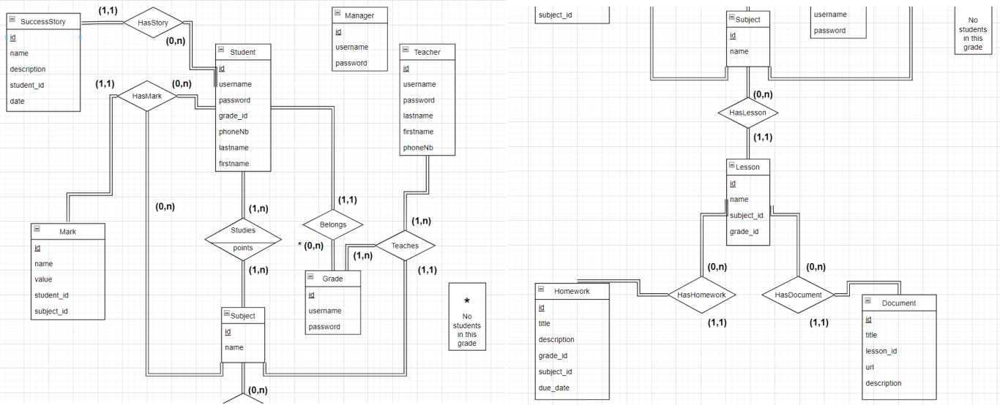
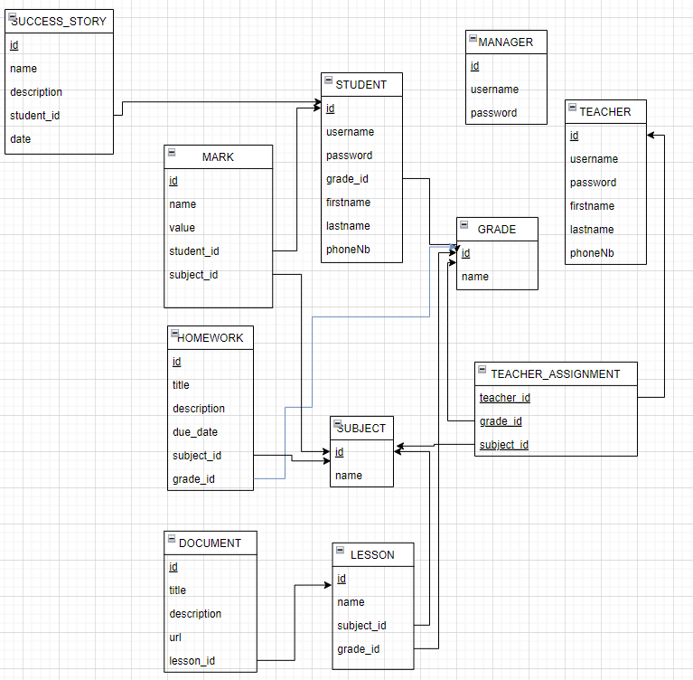

# Learning Management System for Elementary School

## Overview

This project is a Learning Management System (LMS) designed specifically for elementary schools. Developed as the final project for the Database Systems course at the Lebanese American University, this LMS aims to streamline educational processes for students, teachers, and administrators.

## Features

- **User Roles:**
  - Students
  - Teachers
  - Managers (Administrators)

- **Functionality Highlights:**
  - Student access to lessons, homework, and marks.
  - Teacher ability to assign and remove homework, lessons, and manage student marks.
  - Manager tools for adding/removing students and teachers, and assigning teachers to grades and subjects.

## Schema
The database schema follows the relational model with the following conceptual and logical models:

#### CDM
The Conceptual Data Model provides a high-level overview of the entities and their relationships within the system.

#### LCD
The Logical Data Model presents a detailed representation of the tables, attributes, and relationships in the database.

## Screenshots

Here are some screenshots of the interface.

#### Home Page

#### Student Dashboard

#### Teacher Dashboard

#### Manager Dashboard

## Technologies Used

- React v18.2.0
- Node.js v18.12.1
- Express.js v4.18.2
- MySQL Community Server v8.2.0
- Postman v10

